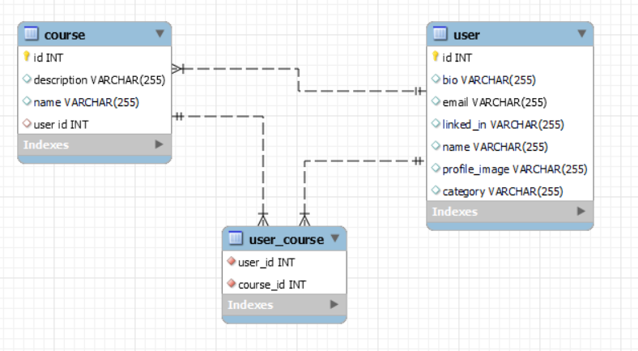

## SETU USER DATA UPLOAD BACKEND
### Tech stack
1. Java (language)
2. Spring Boot (framework)
3. MySQL (database)

### Dependency in Spring Boot
1. `spring boot starter data jap` : It is used for the Object Relational Mapping(ORM) purpose. It helps to fire dynamic query on specified schema according to method given;
```xml
    <dependency>
        <groupId>org.springframework.boot</groupId>
        <artifactId>spring-boot-starter-data-jpa</artifactId>
    </dependency>
```
2. `spring boot starter web` : It helps to create spring boot application for web development. It provides `Auto-configuration`, `Dependency management` etc.;
```xml
    <dependency>
        <groupId>org.springframework.boot</groupId>
        <artifactId>spring-boot-starter-web</artifactId>
    </dependency>
```
3. `springdoc openapi starter webmvc ui` : To generate api-docs or swagger documentation;
```xml
    <dependency>
        <groupId>org.springdoc</groupId>
        <artifactId>springdoc-openapi-starter-webmvc-ui</artifactId>
        <version>2.0.4</version>
    </dependency>
```
4. `modelmapper` : Used for mapping between different java objects. Here we have used it for mapping between entity-object and dto-object;
```xml
        <dependency>
			<groupId>org.modelmapper</groupId>
			<artifactId>modelmapper</artifactId>
			<version>3.1.1</version>
		</dependency>
```
5. `mysql-connector-j` : MySQL Connector/J is the official JDBC driver provided by MySQL for connecting Java applications to MySQL databases;
```xml
    <dependency>
        <groupId>com.mysql</groupId>
        <artifactId>mysql-connector-j</artifactId>
        <scope>runtime</scope>
    </dependency>
```
6. `lombok` : Project Lombok is a Java library that helps to reduce boilerplate code in Java classes, particularly for tasks like getters, setters, constructors.;
```xml
    <dependency>
        <groupId>org.projectlombok</groupId>
        <artifactId>lombok</artifactId>
        <optional>true</optional>
    </dependency>
```
7. `spring-boot-starter-test` : Used for testing.Here we have not done any testing of the api;
```xml
    <dependency>
        <groupId>org.springframework.boot</groupId>
        <artifactId>spring-boot-starter-test</artifactId>
        <scope>test</scope>
    </dependency>
```

### Development guide
1. We have used maven. So make sure you have maven installed in system. Now a days they come inbuilt with java IDEs(Intellij, eclipse).
2. Go to the project folder and run this command to create `.jar` file of application.
```bash
mvn install
```
3. After creation the jar file which is located in `backend/target/backend-0.0.1-SNAPSHOT.jar`, run it by this command
```bash
java -jar backend-0.0.1-SNAPSHOT.jar
```
4. The application will run at port 9091.
5. `Database configuration` : In the `application.properties`, configure it like this
```
spring.application.name=Setu School Backend

server.port=9091

#database configuration
spring.datasource.url=jdbc:mysql://<db_host_name>:<db_port_name>/<db_name>
spring.datasource.username=<db_host_username>
spring.datasource.password=<db_host_password>
spring.datasource.dbcp2.driver-class-name=com.mysql.cj.jdbc.Driver

spring.jpa.properties.hibernate.dialect=org.hibernate.dialect.MySQLDialect
spring.jpa.hibernate.ddl-auto=update

project.image=images/
```
a sample configuration
```spring.application.name=Setu School Backend

server.port=9091

#database configuration
spring.datasource.url=jdbc:mysql://localhost:3306/setu_school
spring.datasource.username=root
spring.datasource.password=root
spring.datasource.dbcp2.driver-class-name=com.mysql.cj.jdbc.Driver

spring.jpa.properties.hibernate.dialect=org.hibernate.dialect.MySQLDialect
spring.jpa.hibernate.ddl-auto=update

project.image=images/
```
7. Also create a database in your machine by this command
```sql
CREATE DATABASE setu_school;
```
6. After starting the application you can see the app is running on port 9091. Head to `http://localhost:9091/swagger-ui/index.html` for swagger documentation. There you can see and send request to available endpoints.

### ER Diagram of Database
Here we have created two schema
1. User : Store user's data
2. Course : Store course data.
   User-Course Has `One-To-Many` mapping



### For github
1. Clone the repo
```bash 
git clone https://github.com/surjendu104/SETU-School-backend.git
```
2. Modify the `application.properties` and database config according to the guide.
3. Start the app.


